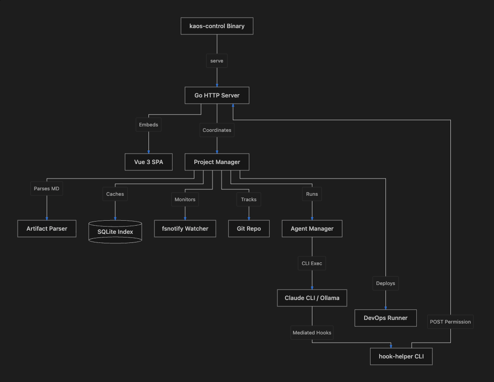

# kaos-control — Code & Architectural Review

## 1. System Philosophy & Architecture Overview
**kaos-control** implements an agent-based Software Development Lifecycle (SDLC) coordinator. The core philosophy is that **files on disk are the source of truth**, while a local SQLite database serves as a query and performance cache. 

The codebase is written in Go, exposes a REST/WebSocket API, and embeds a Vue 3 SPA (built with Vite and TypeScript) using Go's `embed.FS` to ship as a single, compiled binary.



---

## 2. Core Components & Data Structures

### 2.1 Artifact & Parser Package
* **File:** [internal/artifact/artifact.go](file:///Users/keith/Code/kaos-control/internal/artifact/artifact.go)
* **Structural Model:** The [Artifact](file:///Users/keith/Code/kaos-control/internal/artifact/artifact.go#L50) struct represents a parsed markdown file under the `lifecycle/` stages (e.g. `ideas/`, `requirements/`, `backend-plans/`).
* **YAML Frontmatter:** Parsed using `goldmark/frontmatter` into structured fields like `Title`, `Type`, `Status`, `Lineage`, and `Assignees`.
* **Lineage slugs:** Standardizes filename conventions (e.g., `login-1.md` $\rightarrow$ `login-3-be.md`) to preserve chain history across stages.
* **Inline Patching:** [PatchFrontmatterField](file:///Users/keith/Code/kaos-control/internal/artifact/artifact.go#L177) uses raw regex substitutions in the frontmatter block, avoiding full YAML parsing and serialisation, which preserves user formatting, comments, and field ordering.

### 2.2 Index & Cache Layer
* **File:** [internal/index/index.go](file:///Users/keith/Code/kaos-control/internal/index/index.go)
* **Storage Engine:** Employs pure-Go SQLite (`modernc.org/sqlite`).
* **Rebuild Mechanics:** Checks schema version markers on startup. If mismatch is found, it drops and recreates tables automatically.
* **Date Normalization:** Checks on startup for plain `YYYY-MM-DD` dates and rewrites them on-disk to standard RFC3339 format.
* **Path-Traversal Pruning:** [pruneEscapingPaths](file:///Users/keith/Code/kaos-control/internal/index/index.go#L138) checks and cleans any paths that escape the project directory (defending against symlink manipulation or agent write bugs).

### 2.3 Incremental Watcher
* **File:** [internal/watcher/watcher.go](file:///Users/keith/Code/kaos-control/internal/watcher/watcher.go)
* **Debounced fsnotify:** Uses a `150ms` debouncer mapping active timers to paths.
* **Symlink Resilience:** Uses `filepath.EvalSymlinks` to safely resolve absolute paths before matching, preventing macOS volume firmlink escapes (e.g. `/var` vs `/private/var`).
* **Git Watcher:** Watches `.git/HEAD` and `.git/index` to broadcast branch change and git-stage events to client frontends immediately.

### 2.4 Agent Work-Queue Dispatcher
* **File:** [internal/queue/dispatcher.go](file:///Users/keith/Code/kaos-control/internal/queue/dispatcher.go)
* **Dispatcher Loop:** [loop](file:///Users/keith/Code/kaos-control/internal/queue/dispatcher.go#L178) runs as a single-goroutine loop that dequeues and monitors active agent executions.
* **Artifact Validation:** Verifies the target artifact is still `approved` before execution begins.
* **Rate-Limit Remediation:** [handleRateLimit](file:///Users/keith/Code/kaos-control/internal/queue/dispatcher.go#L394) parses rate-limit information out of Claude Code's standard output (detecting resets, message limits, and extra usage limits). It calculates the sleep time, pushes the job back to the front of the queue, and pauses dispatch until the cooldown expires.

---

## 3. Sandboxing & Security Controls (Mediated Hook System)

A stand-out feature of `kaos-control` is how it secures LLM agents executing commands on the local machine:

```
[Agent CLI Process]
        │
        ▼ (PreToolUse Hook)
[hook-helper Executable]
        │
        ▼ (Authenticated HTTP POST)
[Go HTTP server: /api/p/:project/permission]
        │
        ▼ (Evaluate Policy)
 [Check Write Paths & Bash Deny/Allowlists]
        │
        ▼ (Return JSON approval)
[Agent CLI executes or denies tool]
```

### 3.1 Mediated Claude Driver
* **File:** [internal/agent/claude_mediated.go](file:///Users/keith/Code/kaos-control/internal/agent/claude_mediated.go)
* **Hook Setup:** The [ClaudeHooksDriver](file:///Users/keith/Code/kaos-control/internal/agent/claude_mediated.go#L19) creates a temporary `settings.json` configuring a custom tool-calling CLI hook. The CLI hook points back to the current binary using the `hook-helper` subcommand.
* **Run Secret:** A cryptographically secure, per-run token (`KC_HOOK_SECRET`) is injected into the environment. This must match for the HTTP controller to allow incoming decisions.
* **Precheck Guards:** 
  * [runPrecheck](file:///Users/keith/Code/kaos-control/internal/agent/precheck.go#L57): Verifies that regular Claude Code commands are running in `bypassPermissions` mode (i.e. they will skip interactive CLI prompts because we are running headlessly).
  * [runMediatedPrecheck](file:///Users/keith/Code/kaos-control/internal/agent/precheck.go#L145): Conversely, ensures that the mediated driver **does not** skip permissions, forcing Claude Code to query our custom tool hook.

### 3.2 Evaluation Policies
* **File:** [internal/agent/policy.go](file:///Users/keith/Code/kaos-control/internal/agent/policy.go)
* **Permitted Tools:** Read-only tools (e.g. `Read`, `Glob`, `Grep`, `WebSearch`) bypass policies.
* **Mutating Tools:** File-mutating actions (e.g., `Write`, `Edit`) must match paths configured inside `allowed_write_paths` and be scoped to the specific target `LineagePaths` (ensuring developers only modify files they own).
* **Command Shells:** `Bash` tools match against a globs denylist followed by an allowlist.

---

## 4. Operational Optimisations & Design Patterns

The codebase shows deep consideration for performance bottlenecks and server-start safety:

1. **Pre-binding TCP Ports:** [run](file:///Users/keith/Code/kaos-control/cmd/kaos-control/main.go#L111) binds the TCP listener *before* scanning SQLite/Git. Since git-log walks on large codebases can take some time, binding the listener instantly ensures the user's browser connection lands in the accept queue and does not appear to hang.
2. **First Commit Optimization:** Dropped O(commits $\times$ files) walks in git-log to populate created dates. Falling back to mtime on startup speeds up warm starts from ~90 minutes down to ~76 milliseconds, while an explicit CLI tool ([backfill-created](file:///Users/keith/Code/kaos-control/internal/backfillcmd)) can be run once to embed birth times.
3. **Single Writer SQLite:** Configured SQLite with WAL mode (`?_journal=WAL&_busy_timeout=5000`) and set `MaxOpenConns(1)` to respect SQLite concurrency limitations.

---

## 5. Testing Infrastructure
* **Files:** [tests/integration/](file:///Users/keith/Code/kaos-control/tests/integration)
* **Test Suite:** Over 150 integration files, showing exceptional test coverage. These tests verify the state machine transitions, workspace directory syncs, pipeline hooks, rate-limit recovery loops, and the full HTTP endpoints.
